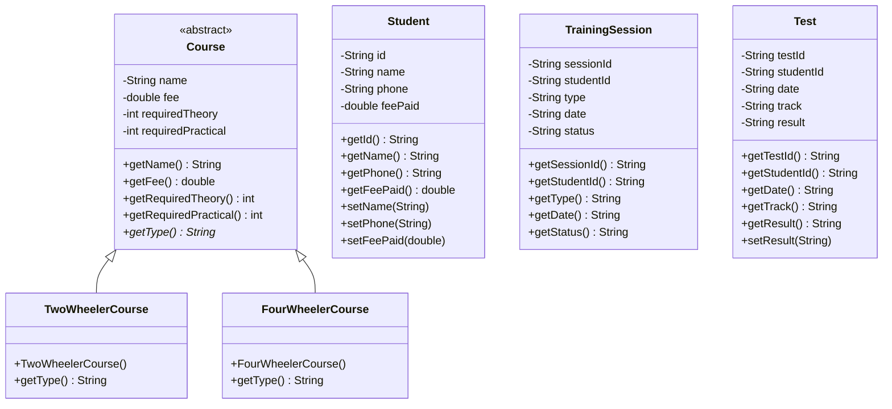

# 🚗 Driving School Enrollment & Test Management System

[](https://www.oracle.com/java/)
[](https://docs.oracle.com/javase/tutorial/uiswing/)
[](https://en.wikipedia.org/wiki/Object-oriented_programming)
[](LICENSE)

A desktop application designed to manage student registrations, track theory and practical session attendance, evaluate test eligibility dynamically, and schedule driving tests across **Two-Wheeler** and **Four-Wheeler** courses.

Built as an academic major project implementation for **Case Study 90: Driving School Enrollment & Test Management System**.

---

## 📌 Problem Statement

Driving schools require a robust system to:
1. Maintain student enrollment records and course assignments.
2. Log attendance across both **Theory** and **Practical** training sessions.
3. Automatically determine if a student meets all course criteria (session counts and fee payment) before permitting test scheduling.
4. Schedule final driving tests and maintain test outcomes.
5. Provide search, sorting, and reporting capabilities via a graphical interface.

---

## ✨ Key Features & Modules

### 1. 📋 Student Enrollment (CRUD)
- Register new students with details: Student ID, Full Name, Contact Number, Course Track, and Fee Paid.
- Update existing student profiles or delete records with cascade cleanup.
- Visual fee status indicator (`PAID` / `DUE (₹ Amount)`).

### 2. 📅 Session Scheduling & Attendance Tracking
- Schedule and log training sessions (`THEORY` / `PRACTICAL`).
- Track session attendance status (`COMPLETED`, `SCHEDULED`, `ABSENT`).
- Stores historical attendance data using an efficient `LinkedList`.

### 3. 🎯 Automated Eligibility Determination
- Real-time pre-check evaluation engine displaying requirements status.
- Blocks test scheduling if the candidate has:
  - Unpaid tuition dues.
  - Insufficient completed theory sessions.
  - Insufficient completed practical sessions.

### 4. 📝 Driving Test Scheduling
- Schedule candidates for their final driving test on strict calendar dates (`YYYY-MM-DD`).
- Update test outcomes (`SCHEDULED`, `PASSED`, `FAILED`).
- Cancel/remove test bookings.

### 5. 🔍 Search & Analytics
- Multi-field keyword search across Student ID, Name, and Course Track.
- **TreeMap Ranking**: Ranks students in descending order based on completed sessions.
- **Chronological Sorting**: Sorts scheduled and completed tests by date.
- **Full Audit Report**: Generates an executive summary and individual student status breakdown.

---

## 📊 Course Track Rules

| Track | Base Fee | Required Theory Sessions | Required Practical Sessions |
| :--- | :---: | :---: | :---: |
| 🏍️ **Two-Wheeler** | ₹3,500 | 5 Sessions | 10 Sessions |
| 🚗 **Four-Wheeler** | ₹7,500 | 8 Sessions | 15 Sessions |

---

## 🛠️ Java Architecture & Concepts Used

| Java Concept | Project Implementation |
| :--- | :--- |
| **Classes & Objects** | `Student`, `Course`, `TrainingSession`, `Test` |
| **Encapsulation** | Private fields with public getters/setters and business logic validation. |
| **Abstract Class** | `Course` serves as the abstract blueprint with abstract method `getType()`. |
| **Inheritance & Polymorphism** | `TwoWheelerCourse` and `FourWheelerCourse` extend `Course` with specialized parameters. |
| **ArrayList** | `studentList` for fast indexed storage of student enrollments. |
| **LinkedList** | `sessionHistory` for chronological insertion and deletion of training session records. |
| **HashMap** | `studentCourseMap` for $O(1)$ lookup mapping `Student ID` $\rightarrow$ `Course`. |
| **TreeMap** | Sorts and ranks students by completed session counts in descending order. |
| **Exception Handling** | Custom checked exceptions `InvalidDataException` and `IneligibleException`. |
| **Data Validation** | Strict date validation (`java.time.LocalDate` / strict Resolver), fee bounds, and duplicate check. |
| **Java Swing GUI** | Custom modern dark-theme UI with `CardLayout`, custom table renderers, and status badges. |

---

## 🏗️ Class Diagram



---

## 🚀 Getting Started

### Prerequisites
- **Java Development Kit (JDK)**: Version 11 or higher (JDK 17+ recommended).

Check your installed Java version:
```bash
java -version
javac -version
```

### 📥 Installation & Running

1. **Clone the repository**:
   ```bash
   git clone https://github.com/kartikwagh21/Java_Major_Project.git
   cd Java_Major_Project
   ```

2. **Compile the application**:
   ```bash
   javac DrivingSchoolApp.java
   ```

3. **Launch the application**:
   ```bash
   java DrivingSchoolApp
   ```

*(Alternatively, run directly on Java 11+ without explicit manual compilation step:)*
```bash
java DrivingSchoolApp.java
```

---

## 📁 Project Structure

```
├── DrivingSchoolApp.java    # Complete Java Swing Application (UI, Logic, Models)
├── Java CaseStudy.pdf      # Case Study 90 Problem Specification Document
└── README.md               # Project documentation
```

---

## 🛡️ Exception Handling & Validation

- **`InvalidDataException`**: Thrown on invalid numeric fees, negative values, empty input fields, duplicate student IDs, or invalid calendar dates (e.g. `2026-02-31`).
- **`IneligibleException`**: Thrown when an administrator attempts to schedule a driving test for a student who has not completed the required sessions or has pending fee dues.

---

## 👤 Author

- **Kartik Wagh** — *B.Tech Computer Science & Engineering*

---

## 📄 License

This project is licensed under the MIT License - see the [LICENSE](LICENSE) file for details.
