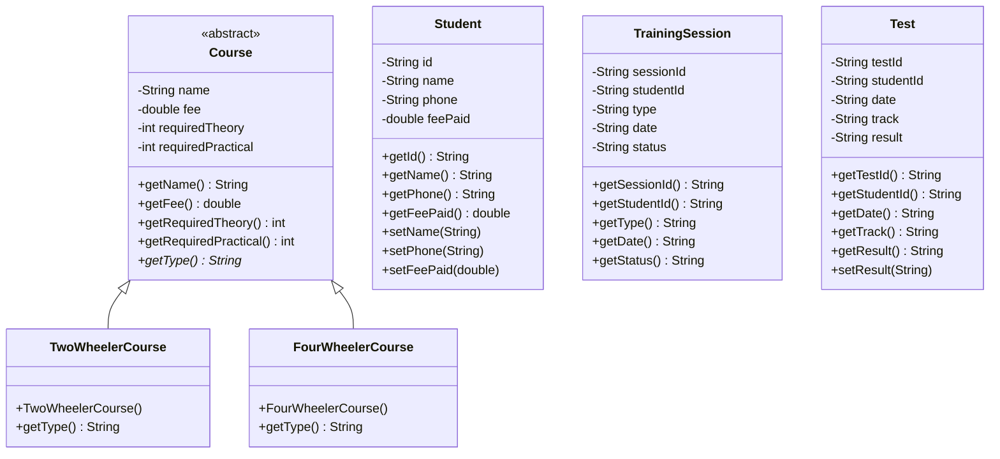

# 🚗 Driving School Enrollment & Test Management System

A Java Swing desktop application developed for **Case Study 90: Driving School Enrollment & Test Management System**. 

The system manages student enrollment, tracks attendance for theory and practical training sessions, automatically evaluates test eligibility criteria, and handles test scheduling across two-wheeler and four-wheeler courses.

---

## 📌 Problem Statement

A driving school needs a system to manage student enrollment, track theory and practical training sessions, and schedule driving tests across two-wheeler and four-wheeler courses. The system automatically flags students who are not yet eligible for their final driving test based on session attendance and fee clearance.

---

## ✨ Features & Modules

### 1. 📋 Student Enrollment (CRUD)
- Register students with Student ID, Name, Phone Number, Course Track, and Fee Paid.
- Update student details or delete enrollment records.
- View real-time fee payment status (`PAID` / `DUE (₹ Amount)`).

### 2. 📅 Session Scheduling & Attendance Tracking
- Schedule and log **Theory** and **Practical** training sessions.
- Record attendance status (`COMPLETED`, `SCHEDULED`, `ABSENT`).
- Maintains historical session logs chronologically using a `LinkedList`.

### 3. 🎯 Automated Eligibility Determination
- Real-time pre-check evaluation before allowing test scheduling.
- Verifies:
  - Full tuition fee clearance.
  - Required theory session completion.
  - Required practical session completion.

### 4. 📝 Test Scheduling & Outcome Management
- Schedule candidates for their final driving test with strict calendar date validation (`YYYY-MM-DD`).
- Record and update test outcomes (`SCHEDULED`, `PASSED`, `FAILED`).
- Option to cancel or delete scheduled tests.

### 5. 🔍 Search, Sorting & Analytics
- **Search**: Multi-attribute filter by Student ID, Name, or Course Track.
- **TreeMap Ranking**: Ranks students in descending order by number of completed sessions.
- **Date Sorting**: Displays scheduled driving tests in chronological order.
- **Audit Report**: Generates an overall driving school summary and detailed eligibility status breakdown.

---

## 📊 Course Track Rules

| Course Track | Course Fee | Required Theory Sessions | Required Practical Sessions |
| :--- | :---: | :---: | :---: |
| 🏍️ **Two-Wheeler** | ₹3,500 | 5 Sessions | 10 Sessions |
| 🚗 **Four-Wheeler** | ₹7,500 | 8 Sessions | 15 Sessions |

---

## 🛠️ Java Concepts & Data Structures Used

| Java Concept | Project Implementation |
| :--- | :--- |
| **Classes & Objects** | `Student`, `Course`, `TrainingSession`, `Test` |
| **Encapsulation** | Private member variables with getters/setters and business logic validation. |
| **Abstract Class** | `Course` base class with abstract method `getType()`. |
| **Inheritance & Polymorphism** | `TwoWheelerCourse` and `FourWheelerCourse` extend `Course`. |
| **ArrayList** | Stores student enrollment records for fast indexed access. |
| **LinkedList** | Maintains training session history chronologically. |
| **HashMap** | Key-value mapping of `Student ID` $\rightarrow$ `Course`. |
| **TreeMap** | Ranks students by number of completed sessions in descending order. |
| **Exception Handling** | Custom checked exceptions `InvalidDataException` and `IneligibleException`. |
| **Data Validation** | Strict date parsing, numeric fee checks, duplicate ID prevention. |
| **Java Swing GUI** | Dark-themed desktop UI with `CardLayout`, custom table renderers, and interactive forms. |

---

## 🏗️ Class Diagram



---

## 🚀 How to Run

### Prerequisites
- Java Development Kit (JDK 11 or higher)

### Steps

1. **Clone the repository**:
   ```bash
   git clone https://github.com/kartikwagh21/Java_Major_Project.git
   cd Java_Major_Project
   ```

2. **Compile the source file**:
   ```bash
   javac DrivingSchoolApp.java
   ```

3. **Run the application**:
   ```bash
   java DrivingSchoolApp
   ```

*(Or run directly on Java 11+ without compiling: `java DrivingSchoolApp.java`)*

---

## 👤 Author

- **Kartik Wagh** — *B.Tech Computer Science & Engineering*
